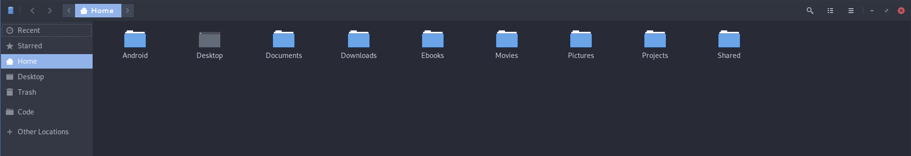

# Firark GTK Theme

The Firark GTK Theme  is an implementation of the [Firark colors](https://github.com/alxkt/firark-colors) as a GKT theme, forked from the [Arc theme](https://github.com/horst3180/arc-theme). The theme name is **Arc-Firark** and can be loaded for both GTK-2.0 and GTK-3.0.

To install, copy the `.gtkrc-2.0` in your home folder, and the `settings.ini` in `~/.config/gtk-3.0/`. This will enable this theme for both versions of the graphic engine. You will also need the Arc icon theme to fully work like intented.

